# HVAC IR Remote Control - Architecture

## System Overview

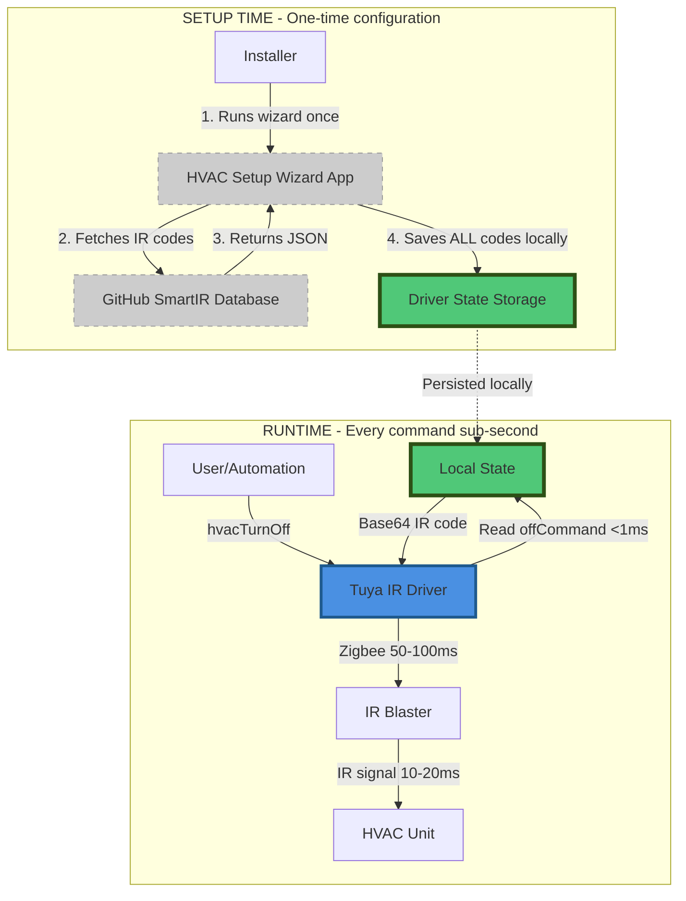

## Performance Architecture

**CRITICAL REQUIREMENT: Sub-second OFF command**

The system uses a clear separation:

### Setup Time (One-time, can be slow)
- Wizard app fetches from GitHub API (500-2000ms)
- App matches learned IR code to database
- App saves **ALL IR codes** to driver local state (~50KB)
- **Total time**: 5-30 seconds (acceptable for one-time setup)

### Runtime (Every command, must be fast)
- Driver reads from local `state.hvacConfig.offCommand` (<1ms)
- Driver sends via Zigbee protocol (50-100ms)
- IR blaster emits signal (10-20ms)
- **Total time**: <200ms (well under 1 second requirement)

**Key Point**: After setup, NO network access required. ALL data is local.

See [PERFORMANCE.md](PERFORMANCE.md) for detailed performance analysis.

## Component Details

### 1. HVAC Setup Wizard App

**Purpose**: Multi-page configuration wizard for sparkies

**Responsibilities**:
- Present installer-friendly UI
- Fetch SmartIR database from GitHub
- Guide IR code learning process
- Match learned codes to HVAC models
- Write configuration to driver

**Key Pages**:
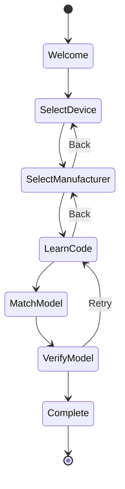

**State Storage**:
```groovy
state.manufacturer = "Panasonic"
state.learnedCode = "JgBQAAAB..."
state.detectedModel = {
    smartIrId: "1020",
    manufacturer: "Panasonic",
    model: "CS/CU-E9PKR",
    commands: { ... }
}
```

---

### 2. Tuya IR Remote Driver

**Purpose**: Device interface and IR protocol handler

**Responsibilities**:
- Zigbee communication with IR blaster
- IR code learning and transmission
- Store HVAC configuration
- Expose runtime commands
- Display readonly configuration attributes

**State Storage**:
```groovy
state.hvacConfig = [
    manufacturer: "Panasonic",
    model: "CS/CU-E9PKR",
    smartIrId: "1020",
    offCommand: "JgBQAAAB...",
    commands: {
        cool: {
            auto: {
                "16": "JgBQAAAB...",
                "17": "JgBQAAAB...",
                // ... 16-30°C
            },
            low: { ... },
            mid: { ... },
            high: { ... }
        },
        heat: { ... },
        fan_only: { ... }
    },
    currentState: [mode: "cool", temp: 24, fan: "auto"]
]
```

---

### 3. SmartIR Database

**Source**: https://github.com/smartHomeHub/SmartIR/tree/master/codes/climate

**Structure**:
```json
{
  "manufacturer": "Panasonic",
  "supportedModels": ["CS/CU-E9PKR"],
  "supportedController": "Broadlink",
  "commandsEncoding": "Base64",
  "minTemperature": 16,
  "maxTemperature": 30,
  "precision": 1,
  "operationModes": ["heat", "cool", "fan_only"],
  "fanModes": ["low", "mid", "high", "auto"],
  "commands": {
    "off": "JgBQAAAB...",
    "heat": {
      "low": {
        "16": "JgBQAAAB...",
        "17": "JgBQAAAB..."
      }
    },
    "cool": { ... }
  }
}
```

---

## Data Flow Diagrams

### Setup Wizard Flow

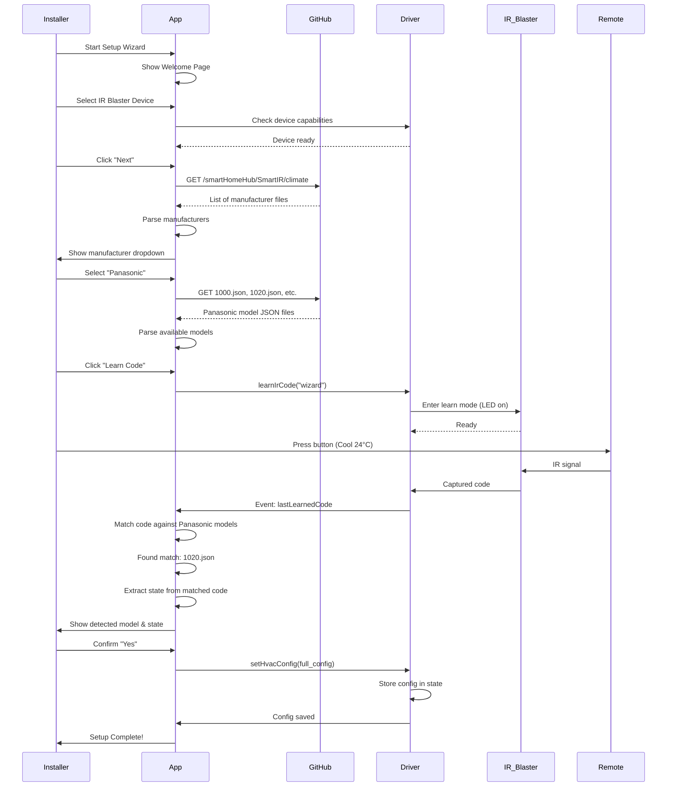

### Runtime Turn Off/Restore Flow

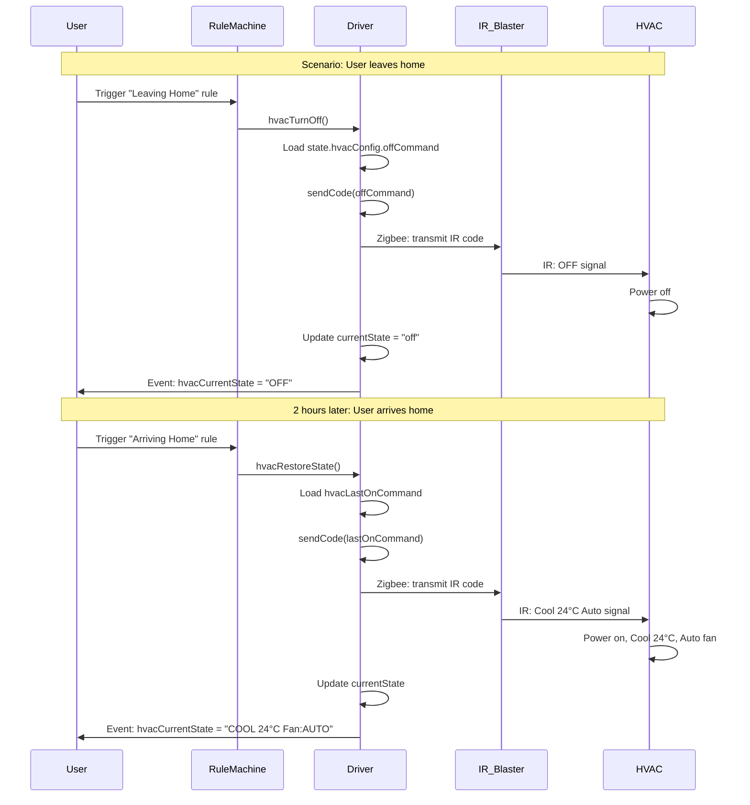

### Manual Command Flow

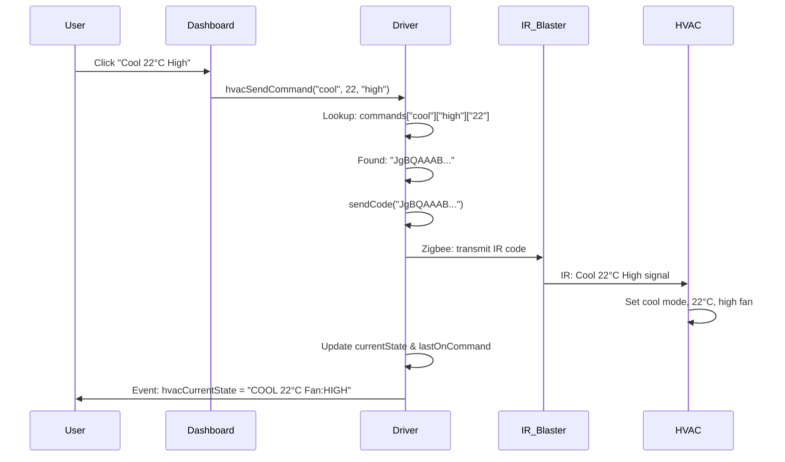

---

## API Integration

### GitHub API Calls

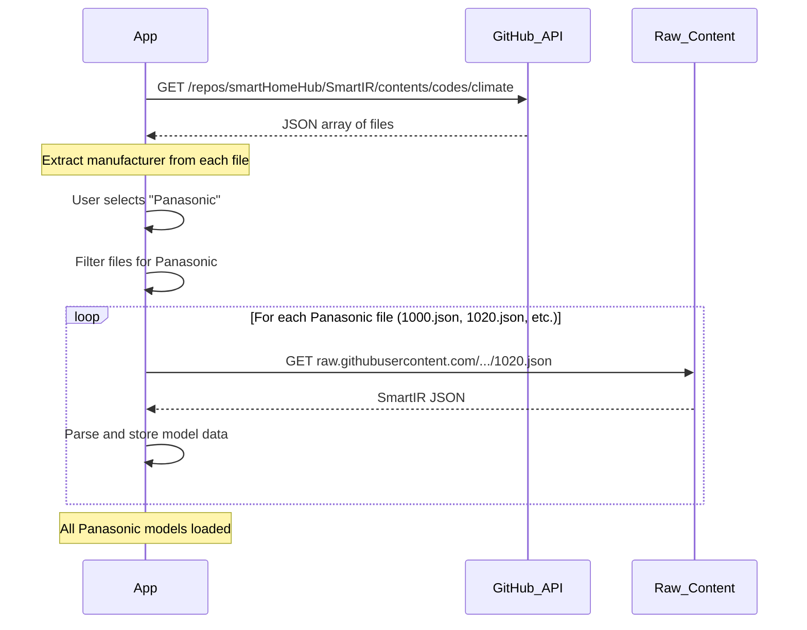

### Code Matching Algorithm

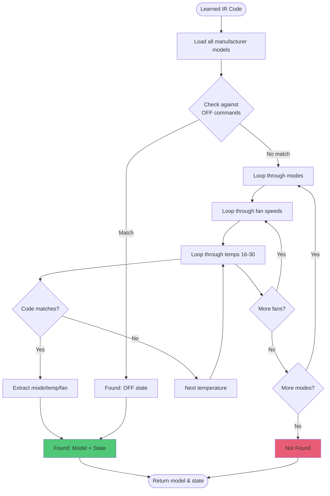

---

## Device State Machine

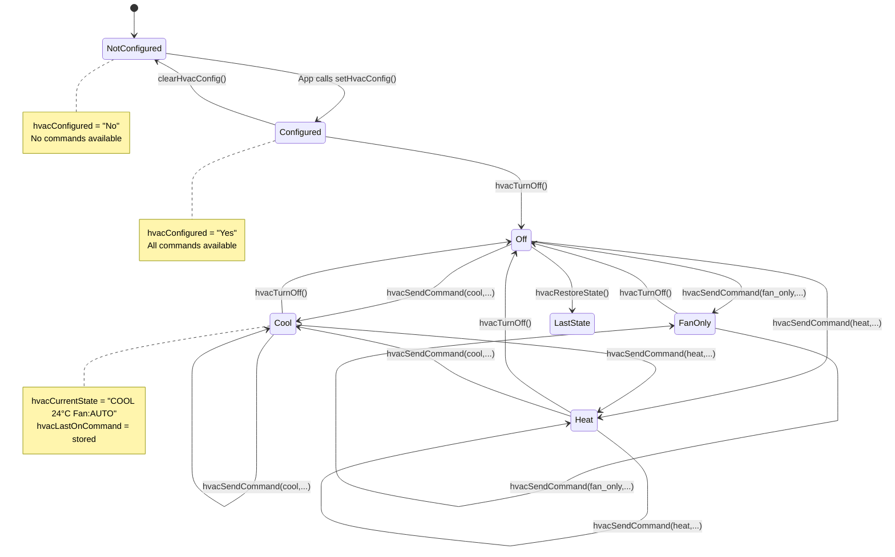

---

## Storage Architecture

### Driver State

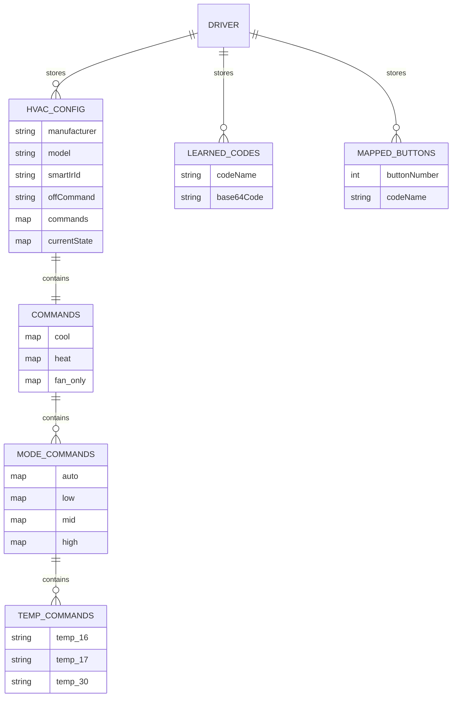

### App State

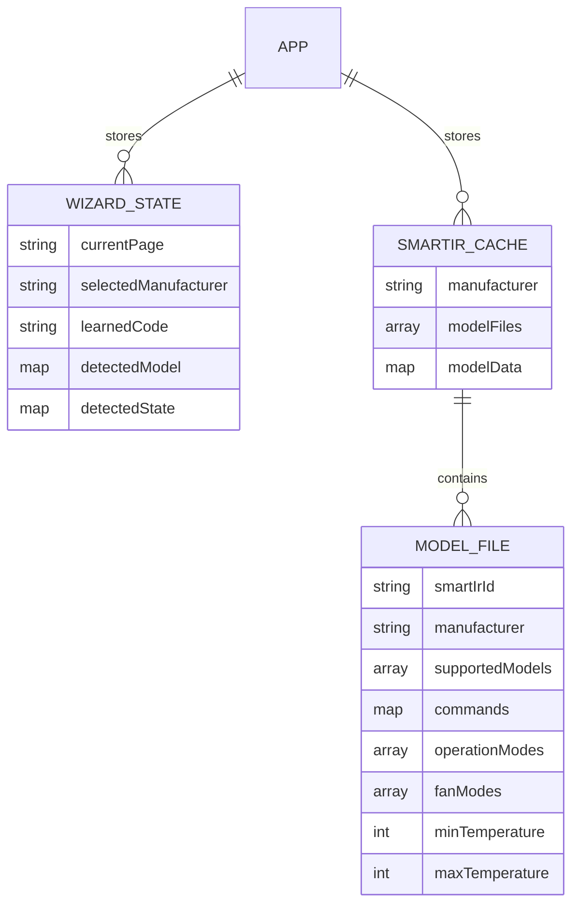

---

## Error Handling

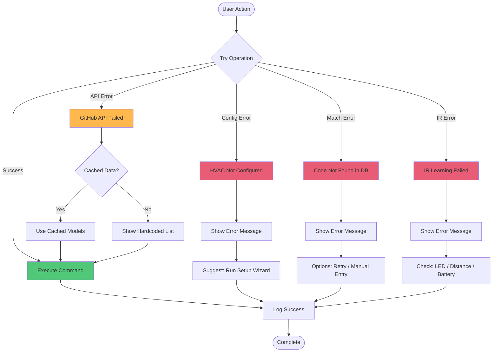

---

## Security & Permissions

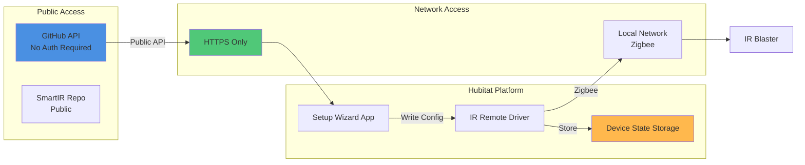

---

## Performance Considerations

### App Initialization
- **First load**: Fetch manufacturer list from GitHub (~500ms)
- **Caching**: Store manufacturer list for 24 hours
- **Lazy loading**: Only fetch specific manufacturer models when selected

### Code Matching
- **Worst case**: ~4800 comparisons (4 modes × 4 fans × 30 temps)
- **Optimization**: Check OFF command first
- **Early exit**: Return immediately on first match

### State Storage
- **Driver state**: ~50-200KB per device (full command tree)
- **App state**: ~5-10KB (temporary wizard state)
- **Cleanup**: Clear wizard state after completion

---

## Deployment

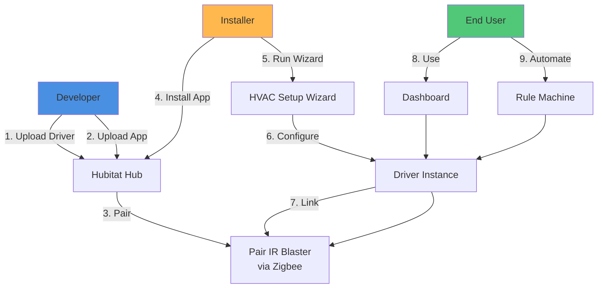

