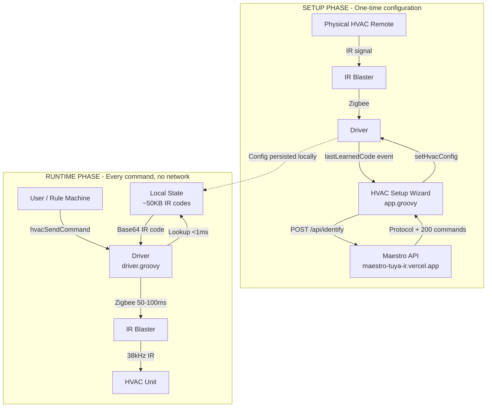
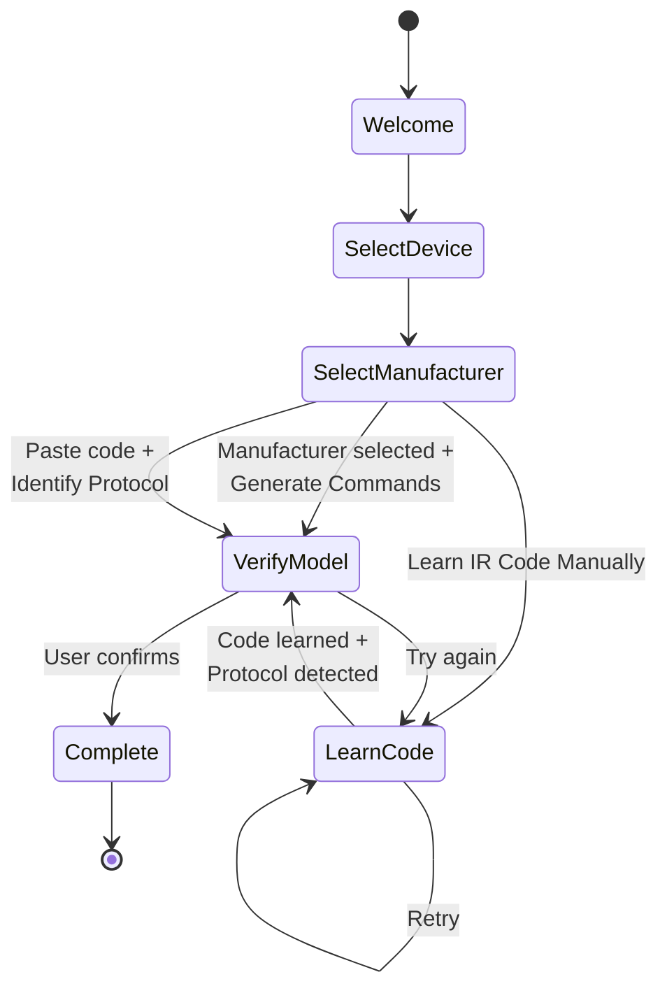
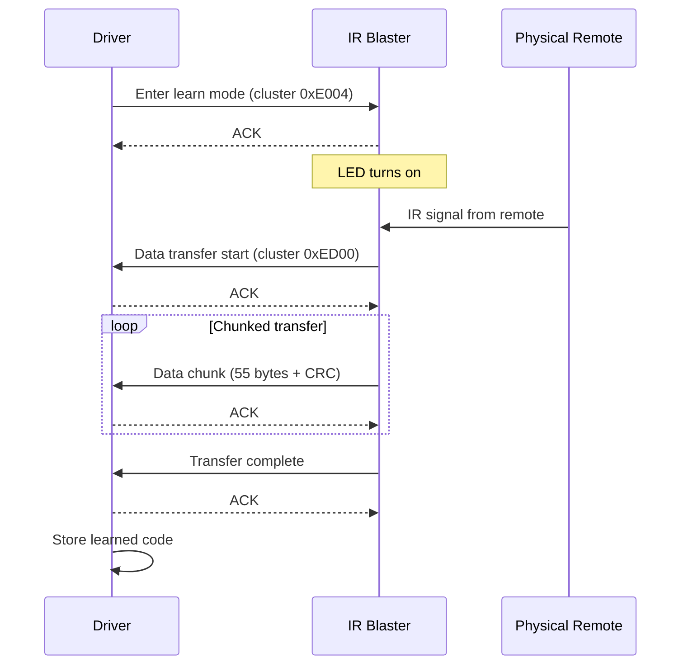
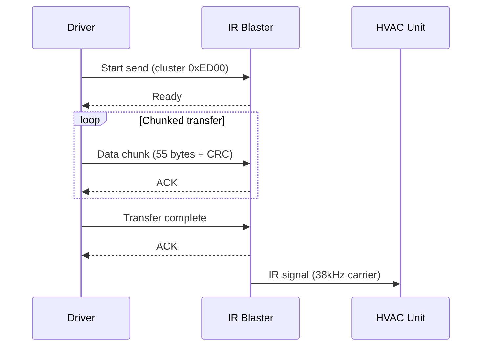
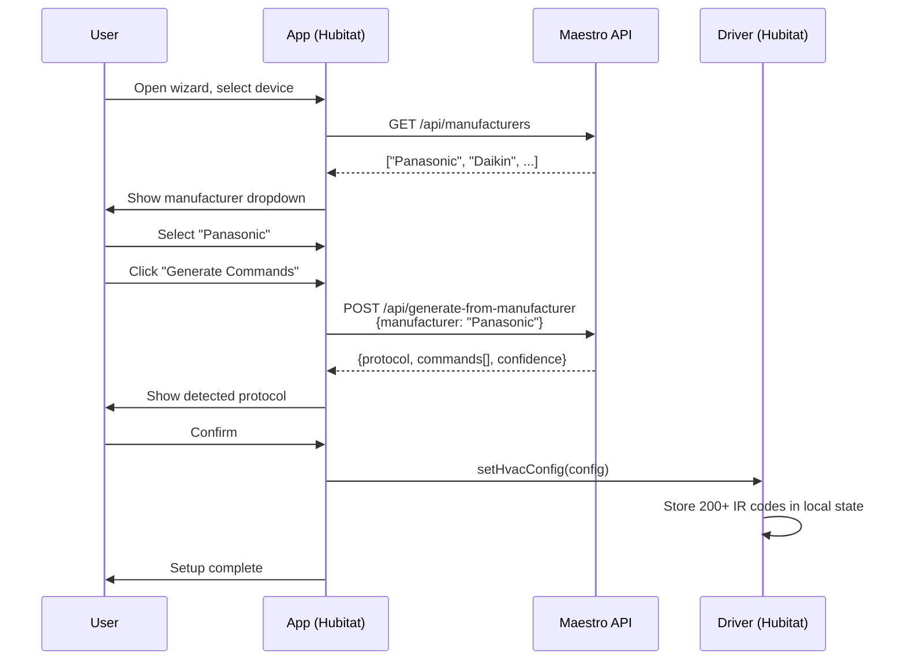
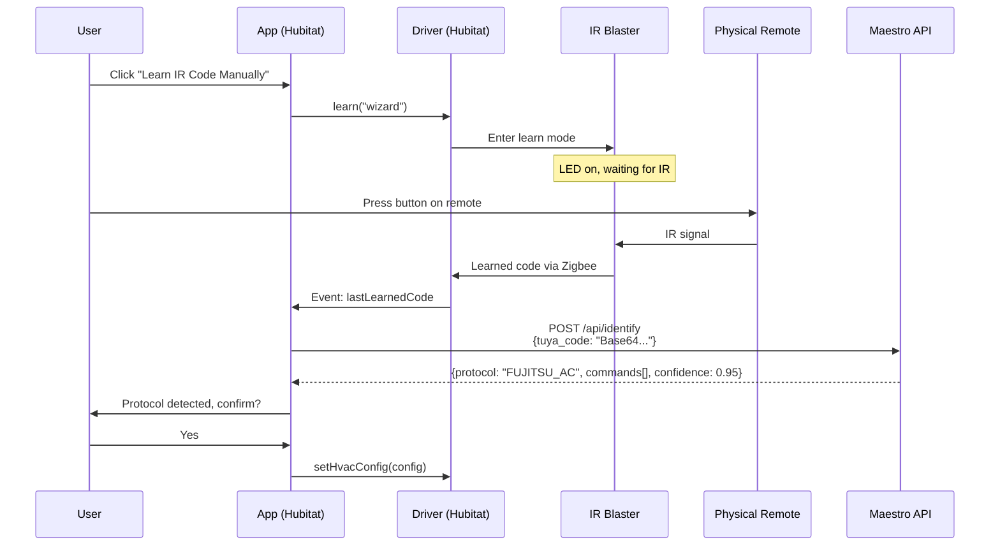
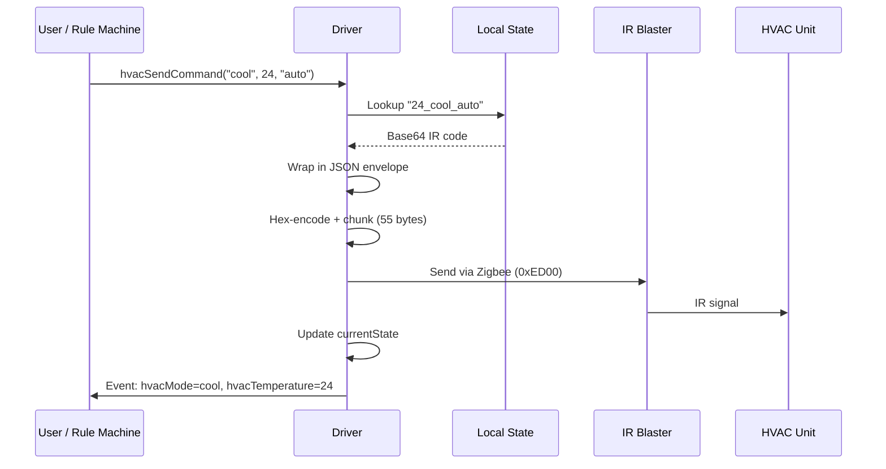
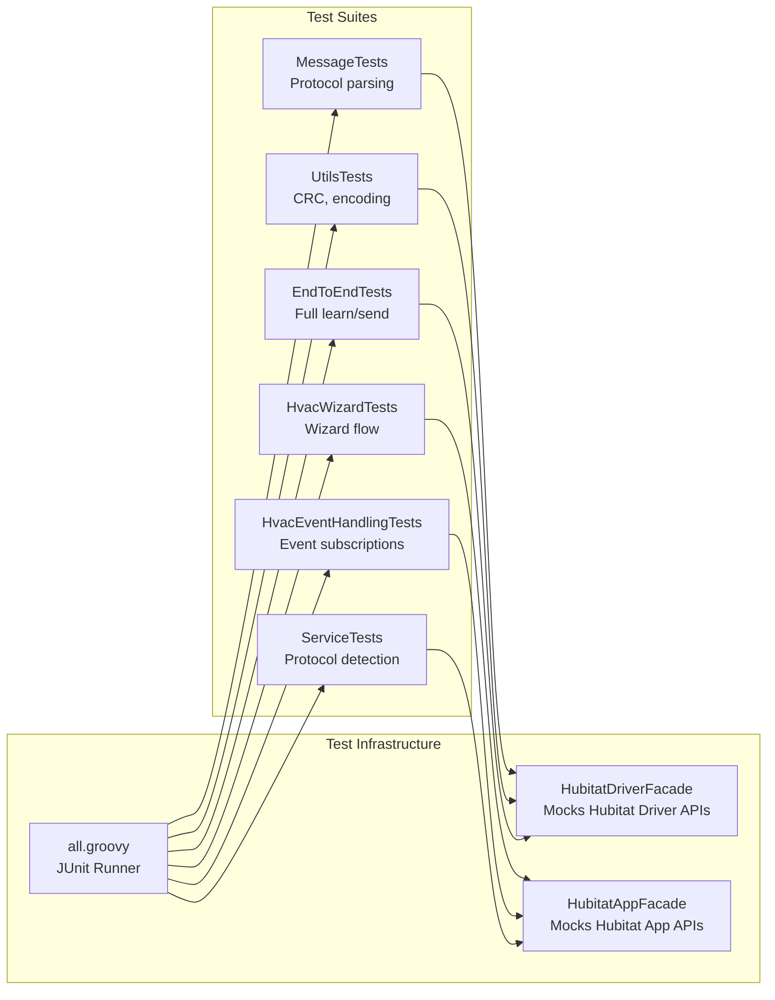

# Architecture

## System Overview

The system has two distinct phases: a one-time setup phase that uses a cloud API, and a runtime phase that operates entirely locally.



## Components

### Driver (`driver.groovy`)

The device driver handles two responsibilities:

1. **Zigbee IR Protocol** - Low-level communication with the Tuya IR blaster using a multi-step binary protocol over Zigbee clusters 0xE004 (learn mode) and 0xED00 (data transfer).

2. **HVAC Command Execution** - Looks up pre-stored IR codes by mode/temperature/fan and transmits them. All commands execute from local state with zero network calls.

### App (`app.groovy`)

A multi-page wizard that configures the driver. Three paths to identify the HVAC protocol:

1. **Manufacturer Selection** - Pick a brand from a dropdown, generate commands from known good codes
2. **IR Code Learning** - Learn a code from the physical remote, auto-detect protocol via API
3. **Manual Code Entry** - Paste a Tuya Base64 IR code for protocol detection

### Maestro API (`maestro-tuya-ir`)

A separate FastAPI service deployed on Vercel that handles IR protocol detection using IRremoteESP8266. See [maestro-tuya-ir](https://github.com/lastmyle/maestro-tuya-ir). The app calls three endpoints:

| Endpoint | Method | Purpose |
|----------|--------|---------|
| `/api/manufacturers` | GET | List brands with known good codes |
| `/api/identify` | POST | Detect protocol from a Tuya Base64 IR code |
| `/api/generate-from-manufacturer` | POST | Generate full command set from known codes |

## Wizard Flow



## Zigbee IR Protocol

The driver implements Tuya's proprietary IR protocol, based on the zigbee-herdsman implementation. Data is chunked into 55-byte segments with CRC validation at each step.

### Learn Sequence (11 steps)



### Send Sequence (7 steps)



### Message Format

IR codes are wrapped in a JSON envelope before chunked transmission:

```json
{
  "key_num": 1,
  "delay": 300,
  "key1": {
    "num": 1,
    "freq": 38000,
    "type": 1,
    "key_code": "<Base64 IR code>"
  }
}
```

The JSON is then hex-encoded and split into 55-byte chunks, each validated with a simple byte-sum CRC (mod 256).

## Data Flow: Setup via Manufacturer Selection



## Data Flow: Setup via IR Learning



## Data Flow: Runtime Command



## State Storage

### Driver State

```groovy
state.hvacConfig = [
    model: "FUJITSU_AC",
    commands: [
        [name: "power_off", tuya_code: "Base64..."],
        [name: "16_cool_auto", tuya_code: "Base64..."],
        [name: "24_heat_high", tuya_code: "Base64..."],
        // ~200 commands total
    ],
    minTemperature: 16,
    maxTemperature: 30,
    operationModes: ["cool", "heat", "dry", "fan", "auto"],
    fanModes: ["auto", "quiet", "low", "medium", "high"],
    currentState: [mode: "cool", temp: 24, fan: "auto"]
]

// General IR remote codes (non-HVAC)
state.learnedCodes = [
    "PowerToggle": "Base64...",
    "VolumeUp": "Base64..."
]
state.buttonMappings = [
    "1": "PowerToggle",
    "2": "VolumeUp"
]
```

### Semi-Persistent Buffers

The Zigbee protocol requires tracking state across multiple asynchronous message exchanges. The driver uses `@Field static ConcurrentHashMap` for this:

```
SEND_BUFFERS[deviceId][seqNum]    → {buffer: List<byte>}
RECEIVE_BUFFERS[deviceId][seqNum] → {expectedLength, buffer: List<byte>}
PENDING_LEARN_CODE_NAMES          → Stack of code names awaiting save
PENDING_RECEIVE_SEQS              → Stack of sequence IDs for receive ops
```

These survive between Hubitat method invocations but not hub reboots - which is fine since learn/send operations complete in seconds.

## Testing Architecture



The test facades parse the actual `driver.groovy` and `app.groovy` files, evaluate them in a `GroovyShell`, and inject mocks for Hubitat-specific APIs (`log`, `device`, `zigbee`, `state`, `httpGet`, `httpPost`, etc.). This lets tests run against the real code without a Hubitat hub.

## CI/CD

Tests run on every push to `main` via GitHub Actions using a `groovy:2.4-jre` Docker image to match the Hubitat platform's Groovy version exactly.

Deployment is manual: `make deploy` copies driver and app code to clipboard for pasting into the Hubitat web UI. There is no API-based deployment path for Hubitat.
