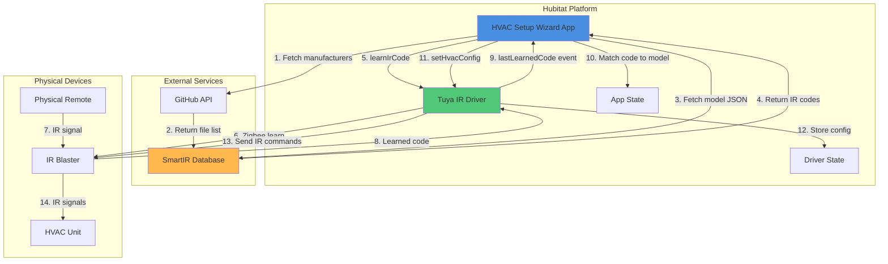
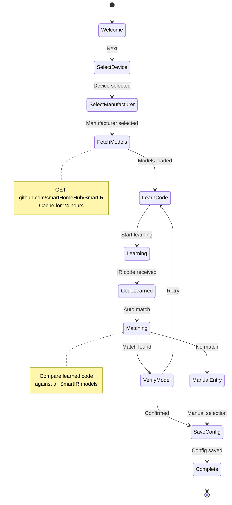
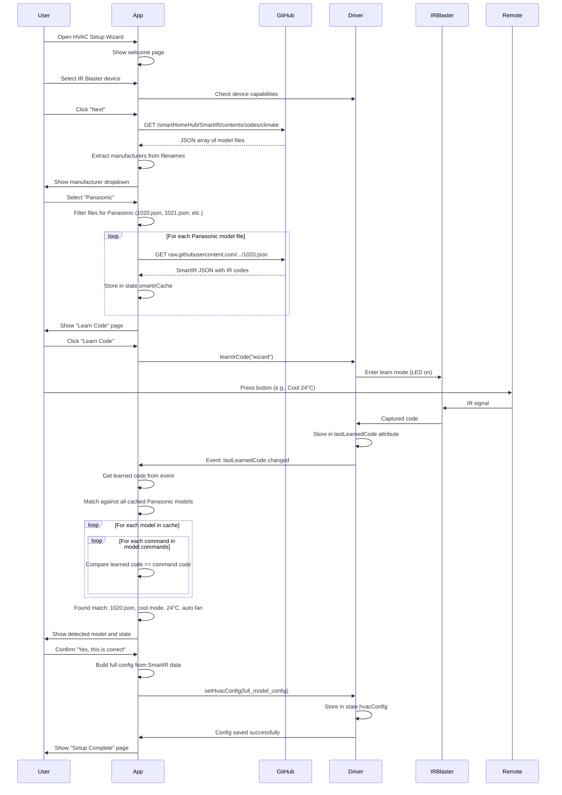

# HVAC Setup Wizard - Implementation Plan

## Executive Summary

This plan outlines the complete implementation of an HVAC Setup Wizard system for Hubitat's Tuya Zigbee IR Remote Control. The system consists of:

1. **HVAC Setup Wizard App** - Multi-page configuration interface
2. **Enhanced Driver** - Already has HVAC interface methods
3. **SmartIR Integration** - Automatic model detection from learned IR codes

## System Architecture



## Wizard Flow



## Sequence Diagram: Complete Setup Flow



## Data Structures

### App State

```groovy
state.smartirCache = [
    lastFetched: 1234567890,  // Timestamp
    manufacturers: [
        "Panasonic": [
            "1020": [
                manufacturer: "Panasonic",
                supportedModels: ["CS/CU-E9PKR", "CS/CU-E12PKR"],
                operationModes: ["heat", "cool", "fan_only"],
                fanModes: ["low", "mid", "high", "auto"],
                minTemperature: 16,
                maxTemperature: 30,
                commands: [
                    off: "JgBQAAAB...",
                    heat: [
                        low: [
                            "16": "JgBQAAAB...",
                            "17": "JgBQAAAB...",
                            // ... 16-30
                        ],
                        mid: [ ... ],
                        high: [ ... ],
                        auto: [ ... ]
                    ],
                    cool: [ ... ],
                    fan_only: [ ... ]
                ]
            ],
            "1021": [ ... ]
        ],
        "Daikin": [ ... ]
    ]
]

state.wizardState = [
    currentPage: "learnCode",
    selectedManufacturer: "Panasonic",
    learnedCode: "JgBQAAAB...",
    detectedModel: [
        smartIrId: "1020",
        manufacturer: "Panasonic",
        model: "CS/CU-E9PKR",
        state: [mode: "cool", temp: 24, fan: "auto"]
    ]
]
```

### Driver State (Already Implemented)

```groovy
state.hvacConfig = [
    manufacturer: "Panasonic",
    model: "CS/CU-E9PKR",
    smartIrId: "1020",
    offCommand: "JgBQAAAB...",
    commands: [
        cool: [
            auto: [
                "16": "JgBQAAAB...",
                "17": "JgBQAAAB...",
                // ... 16-30
            ],
            low: [ ... ],
            mid: [ ... ],
            high: [ ... ]
        ],
        heat: [ ... ],
        fan_only: [ ... ]
    ],
    currentState: [mode: "cool", temp: 24, fan: "auto"]
]
```

## Implementation Tasks

### 1. SmartIR API Integration

#### 1.1 Fetch Manufacturer List
```groovy
def fetchManufacturerList() {
    try {
        def params = [
            uri: "https://api.github.com",
            path: "/repos/smartHomeHub/SmartIR/contents/codes/climate",
            headers: [
                "Accept": "application/vnd.github.v3+json",
                "User-Agent": "Hubitat-HVAC-Wizard"
            ],
            timeout: 10
        ]

        httpGet(params) { resp ->
            if (resp.status == 200) {
                def manufacturers = []
                resp.data.each { file ->
                    if (file.name.endsWith(".json")) {
                        // Extract manufacturer from filename or first fetch
                        manufacturers.add(file.name.replaceAll(/\.json$/, ""))
                    }
                }
                return manufacturers.unique().sort()
            }
        }
    } catch (e) {
        log.error "Failed to fetch manufacturers: ${e.message}"
        // Return hardcoded list as fallback
        return getHardcodedManufacturers()
    }
}
```

#### 1.2 Fetch Models for Manufacturer
```groovy
def fetchModelsForManufacturer(String manufacturer) {
    // Check cache first
    if (isCacheValid() && state.smartirCache?.manufacturers?[manufacturer]) {
        log.debug "Using cached models for ${manufacturer}"
        return state.smartirCache.manufacturers[manufacturer]
    }

    def models = [:]

    try {
        // Get file list
        def params = [
            uri: "https://api.github.com",
            path: "/repos/smartHomeHub/SmartIR/contents/codes/climate",
            headers: [
                "Accept": "application/vnd.github.v3+json",
                "User-Agent": "Hubitat-HVAC-Wizard"
            ]
        ]

        httpGet(params) { resp ->
            // Filter files for this manufacturer
            def manufacturerFiles = resp.data.findAll { file ->
                file.name.endsWith(".json")
            }

            // Fetch each model file
            manufacturerFiles.each { file ->
                def modelId = file.name.replaceAll(/\.json$/, "")
                def modelData = fetchModelFile(file.download_url)

                // Only include if manufacturer matches
                if (modelData?.manufacturer?.toLowerCase() == manufacturer.toLowerCase()) {
                    models[modelId] = modelData
                }
            }
        }

        // Cache the results
        if (!state.smartirCache) state.smartirCache = [:]
        if (!state.smartirCache.manufacturers) state.smartirCache.manufacturers = [:]
        state.smartirCache.manufacturers[manufacturer] = models
        state.smartirCache.lastFetched = now()

        return models

    } catch (e) {
        log.error "Failed to fetch models for ${manufacturer}: ${e.message}"
        return [:]
    }
}
```

#### 1.3 Fetch Individual Model File
```groovy
def fetchModelFile(String downloadUrl) {
    try {
        def params = [
            uri: downloadUrl,
            headers: [
                "User-Agent": "Hubitat-HVAC-Wizard"
            ],
            timeout: 10
        ]

        httpGet(params) { resp ->
            if (resp.status == 200) {
                return resp.data  // Already parsed as JSON by Hubitat
            }
        }
    } catch (e) {
        log.error "Failed to fetch model file: ${e.message}"
        return null
    }
}
```

### 2. Code Matching Algorithm

```groovy
def matchCodeToModel(String learnedCode, String manufacturer) {
    def models = state.smartirCache?.manufacturers?[manufacturer]

    if (!models) {
        log.warn "No models cached for manufacturer: ${manufacturer}"
        return null
    }

    // Normalize learned code (remove whitespace)
    String normalizedCode = learnedCode.replaceAll(/\s/, "")

    // Search through all models
    for (modelEntry in models) {
        def modelId = modelEntry.key
        def modelData = modelEntry.value

        // Check OFF command first (common shortcut)
        if (normalizedCode == modelData.commands?.off?.replaceAll(/\s/, "")) {
            return [
                smartIrId: modelId,
                manufacturer: modelData.manufacturer,
                model: modelData.supportedModels?.join(", "),
                modelData: modelData,
                detectedState: [mode: "off", temp: null, fan: null]
            ]
        }

        // Check all mode/fan/temp combinations
        for (mode in modelData.commands?.keySet()) {
            if (mode == "off") continue  // Already checked

            def modeCommands = modelData.commands[mode]
            if (!(modeCommands instanceof Map)) continue

            for (fanSpeed in modeCommands.keySet()) {
                def fanCommands = modeCommands[fanSpeed]
                if (!(fanCommands instanceof Map)) continue

                for (temp in fanCommands.keySet()) {
                    def irCode = fanCommands[temp]
                    if (normalizedCode == irCode?.replaceAll(/\s/, "")) {
                        return [
                            smartIrId: modelId,
                            manufacturer: modelData.manufacturer,
                            model: modelData.supportedModels?.join(", "),
                            modelData: modelData,
                            detectedState: [
                                mode: mode,
                                temp: temp.toInteger(),
                                fan: fanSpeed
                            ]
                        ]
                    }
                }
            }
        }
    }

    log.warn "No match found for learned code in ${manufacturer} models"
    return null
}
```

### 3. Wizard App Pages

Already outlined in hvac-setup-app.groovy, needs implementation of:
- SmartIR integration calls
- Event subscription handling
- Proper button handling
- Error handling and retry logic

### 4. Testing Infrastructure

Create `tst/HubitatAppFacade.groovy` to test apps similar to driver facade.

## Success Criteria

- [ ] App fetches manufacturers from GitHub successfully
- [ ] App fetches and caches SmartIR models
- [ ] Code matching algorithm finds correct model (>90% accuracy)
- [ ] Wizard navigates through all pages correctly
- [ ] Configuration is saved to driver successfully
- [ ] Runtime commands work after configuration
- [ ] All tests pass
- [ ] Cache invalidation works correctly (24 hour expiry)
- [ ] Offline fallback to hardcoded manufacturers works

## Next Steps

1. ✅ Create this implementation plan
2. Implement SmartIR API integration functions
3. Implement code matching algorithm
4. Fix wizard app pages and navigation
5. Create app testing infrastructure
6. Add comprehensive tests
7. Run full test suite and fix issues
8. Documentation and README updates
