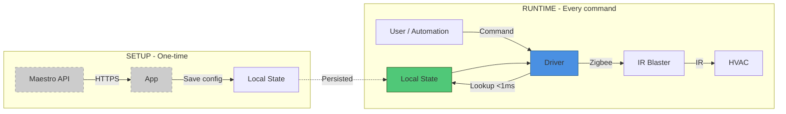

# Security

## Threat Model

This is a home automation system controlling HVAC units via IR. The primary security goal is preventing unauthorized control of HVAC equipment. The threat model assumes a typical residential environment with a locally-managed Hubitat hub.

### What We Protect

- **HVAC control integrity** - Only authorized users and automations should be able to send IR commands
- **Configuration integrity** - Stored IR codes and protocol configuration should not be tampered with
- **Network privacy** - Minimize data sent to external services

### What We Don't Protect

- **IR code secrecy** - IR codes are hardware-specific protocol data, not user secrets. Anyone with the same model remote has the same codes.
- **Physical IR interception** - IR is inherently broadcast; anyone in line-of-sight can capture signals. This is a limitation of IR as a technology, not a software concern.

## Architecture: Local-First Design

The system is designed so that after one-time setup, **no network access is required for any operation**.

This means:
- Internet outages do not affect HVAC control
- The cloud API cannot be used to remotely control devices
- No ongoing data exfiltration vector exists after setup

## Network Security

### External API Communication (Setup Only)

The wizard app communicates with the Maestro API (`maestro-tuya-ir.vercel.app`) during initial setup only.

| Property | Detail |
|----------|--------|
| Protocol | HTTPS (TLS encrypted) |
| Authentication | None required (public API) |
| Data sent | Base64-encoded IR timing data, or manufacturer name |
| Data received | Protocol name, IR command set |
| Frequency | Once during setup, never again at runtime |
| Sensitivity | Low - IR codes are hardware protocol data, not user PII |

No API keys, tokens, or credentials are used or stored.

### Zigbee Communication (Runtime)

All runtime commands travel over the local Zigbee mesh network between the Hubitat hub and the IR blaster.

| Property | Detail |
|----------|--------|
| Protocol | Zigbee 3.0 |
| Encryption | AES-128 (Zigbee network key) |
| Range | Local mesh only (~10-30m) |
| Authentication | Zigbee device pairing |

Zigbee traffic never leaves the local network.

### No Persistent Network Connections

The system makes no outbound connections at runtime. There are no webhooks, no polling, no telemetry, no analytics. The only network activity is the user-initiated API calls during the setup wizard.

## Data Storage

### What Is Stored

All data resides in the Hubitat hub's local state storage:

| Data | Location | Sensitivity |
|------|----------|-------------|
| HVAC IR codes (~200 commands) | `driver.state.hvacConfig` | Low - hardware protocol data |
| Learned IR codes | `driver.state.learnedCodes` | Low - hardware protocol data |
| Button mappings | `driver.state.buttonMappings` | None |
| HVAC current state | `driver.state.hvacConfig.currentState` | None |
| Wizard state | `app.state.wizardState` | Low - cleared after setup |

### What Is NOT Stored

- No user credentials or passwords
- No API keys or tokens
- No personal information
- No usage analytics or telemetry data
- No cloud account identifiers

### Storage Security

Data is stored in Hubitat's local state, which is:
- Accessible only via the Hubitat admin UI (local network)
- Not replicated to any cloud service by this driver
- Cleared on device removal or app uninstall

IR codes are stored in cleartext. This is acceptable because they are not secrets - they are deterministic hardware protocol encodings that anyone with the same model equipment can generate.

## Attack Surface Analysis

### 1. Maestro API Compromise (Low Impact)

**Vector**: Attacker compromises the Maestro API to return malicious IR codes during setup.

**Impact**: Incorrect IR commands sent to HVAC during verification step. The wizard requires user confirmation before saving, so the user would notice unexpected behavior during testing.

**Mitigation**:
- User verifies commands work correctly before finalizing setup
- API is only contacted during interactive setup, not runtime
- Worst case: HVAC receives wrong commands (uncomfortable, not dangerous)

### 2. Hubitat Hub Compromise (High Impact, Out of Scope)

**Vector**: Attacker gains access to the Hubitat admin interface.

**Impact**: Full control of all connected devices, including HVAC.

**Mitigation**: This is a Hubitat platform security concern, not specific to this driver. Standard mitigations apply:
- Secure the hub admin interface
- Use strong passwords
- Keep hub firmware updated
- Isolate IoT network

### 3. Zigbee Network Attack (Low Probability)

**Vector**: Attacker joins the Zigbee network during pairing window, or performs Zigbee key extraction.

**Impact**: Could send IR commands via the blaster.

**Mitigation**:
- Keep pairing window short
- Standard Zigbee 3.0 security (AES-128)
- IR commands are limited to what the HVAC supports (no safety risk)

### 4. Man-in-the-Middle on Setup API (Mitigated)

**Vector**: Intercept HTTPS traffic to Maestro API during setup.

**Impact**: Could see IR codes being sent for identification or inject modified responses.

**Mitigation**:
- HTTPS with TLS certificate validation
- Data transmitted is low sensitivity (IR timing data)
- User confirms results before saving

## Privacy

- **No telemetry**: The driver and app collect no usage data
- **No analytics**: No tracking of any kind
- **No cloud dependency at runtime**: After setup, the system is fully air-gapped from the internet
- **No PII**: No personal information is processed or stored
- **Minimal data to API**: Only IR timing data (hardware protocol, not user data) is sent during setup

## Dependency Security

| Dependency | Type | Trust Level |
|------------|------|-------------|
| Hubitat Platform | Runtime environment | High - user-managed local hub |
| Groovy 2.4.x | Language runtime | High - provided by Hubitat |
| Maestro API | Setup-time only | Medium - public API, HTTPS, verified by user |
| Zigbee stack | Communication | High - industry standard, AES-128 |

The driver has no third-party library dependencies. All code runs within the Hubitat Groovy sandbox.

## Reporting Security Issues

If you discover a security vulnerability, please report it via GitHub Issues or contact the maintainer directly. Do not open a public issue for active exploits.
